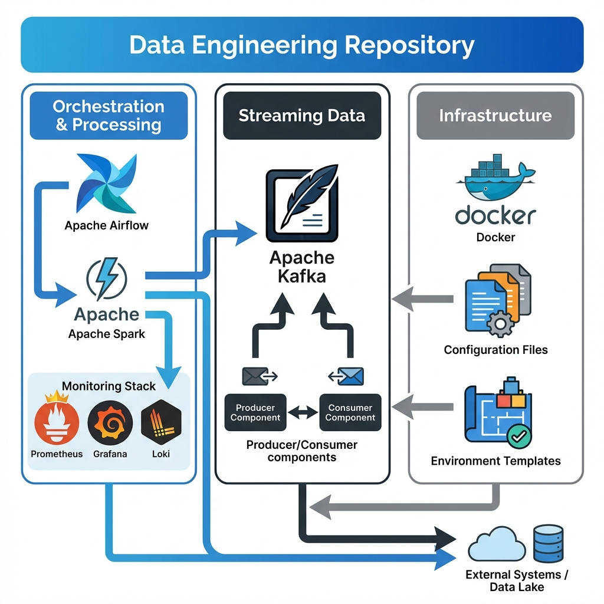
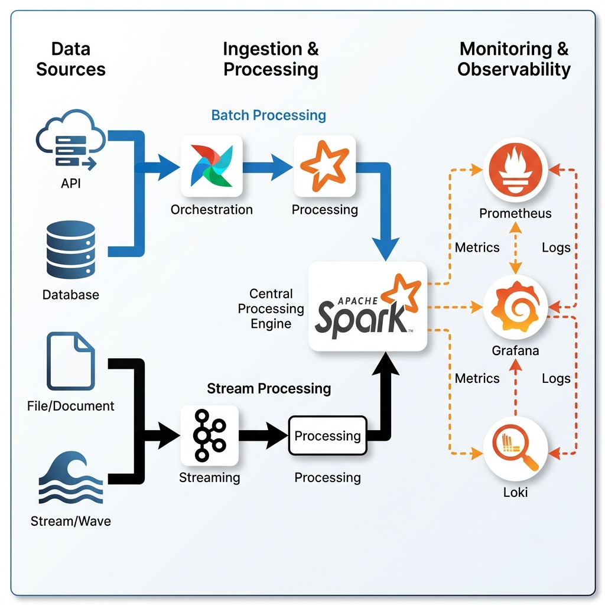

# Data Engineering Projects

<div align="center">


**A collection of production-ready data engineering projects demonstrating modern data infrastructure, orchestration, and streaming technologies.**

[Projects](#projects) • [Architecture](#architecture) • [Quick Start](#quick-start) • [Security](#security) • [Contributing](#contributing)

</div>

---

## 📋 Table of Contents

- [Overview](#overview)
- [Architecture](#architecture)
- [Projects](#projects)
- [Technology Stack](#technology-stack)
- [Quick Start](#quick-start)
- [Security Best Practices](#security-best-practices)
- [Contributing](#contributing)
- [License](#license)

---

## 🎯 Overview

This repository contains hands-on data engineering projects designed to demonstrate real-world implementations of:

- **Data Orchestration** with Apache Airflow
- **Distributed Processing** with Apache Spark
- **Stream Processing** with Apache Kafka
- **Infrastructure as Code** with Docker Compose
- **Observability** with Prometheus, Grafana, and Loki
- **Production-Ready Patterns** for data pipelines

Each project is self-contained, fully documented, and ready to run locally with minimal setup.

---

## 🏗️ Architecture

### Repository Structure



The repository is organized into three main pillars:
- **Orchestration & Processing**: Airflow, Spark, and monitoring tools
- **Streaming Data**: Kafka-based streaming projects
- **Infrastructure**: Docker, configuration, and environment management

### Technology Integration



The architecture demonstrates end-to-end data flow:
- **Data Sources**: APIs, databases, files, and streams
- **Batch Processing**: Airflow orchestrates Spark jobs
- **Stream Processing**: Kafka handles real-time data
- **Central Engine**: Spark processes both batch and streaming data
- **Monitoring**: Prometheus, Grafana, and Loki provide observability

---

## 📁 Projects

### 1. Airflow Sandbox with Spark & Monitoring

A **production-grade** data orchestration environment featuring Apache Airflow, Spark, and a complete observability stack.

**Status:** ✅ Production Ready

**Features:**
- 🔄 Apache Airflow 2.9.3 with CeleryExecutor
- ⚡ Apache Spark 3.5.0 cluster (master + worker)
- 📊 Full monitoring stack (Prometheus, Grafana, Loki)
- 🐳 Docker Compose orchestration
- 📈 Pre-built Grafana dashboards
- 🔔 Alerting rules configured
- 🔒 Security best practices

**Technologies:**
- Apache Airflow
- Apache Spark (PySpark)
- PostgreSQL (metadata)
- Redis (message broker)
- Prometheus (metrics)
- Grafana (visualization)
- Loki (log aggregation)
- cAdvisor (container metrics)

**Quick Start:**
```bash
cd de_projects/airflow_sandbox
docker-compose up -d
```

**Access:**
- Airflow UI: http://localhost:8080
- Grafana: http://localhost:3000
- Prometheus: http://localhost:9090
- Spark Master: http://localhost:8081

📖 **[Full Documentation →](./de_projects/airflow_sandbox/README.md)**

---

### 2. Kafka 101: Producer and Consumer

A foundational introduction to Apache Kafka demonstrating core concepts of stream processing.

**Status:** ✅ Complete

**Features:**
- 📨 Simple producer implementation
- 📬 Consumer with offset management
- 🔄 Message serialization/deserialization
- 🐍 Python-based examples

**Technologies:**
- Apache Kafka
- Python 3.x
- kafka-python library

**Quick Start:**
```bash
cd de_projects/Kakfa_projects/Kafka_101
# Follow project README for setup
```

📖 **[Full Documentation →](./de_projects/Kakfa_projects/Kafka_101/Readme.md)**

---

## 🛠️ Technology Stack

### Orchestration & Workflow
- **Apache Airflow** - Workflow orchestration and scheduling
- **Celery** - Distributed task execution

### Processing & Compute
- **Apache Spark** - Distributed data processing
- **PySpark** - Python API for Spark

### Streaming
- **Apache Kafka** - Distributed event streaming

### Data Storage
- **PostgreSQL** - Relational database (Airflow metadata)
- **Redis** - In-memory data store (message broker)

### Monitoring & Observability
- **Prometheus** - Metrics collection and storage
- **Grafana** - Visualization and dashboards
- **Loki** - Log aggregation
- **Promtail** - Log shipping
- **cAdvisor** - Container metrics

### Infrastructure
- **Docker** - Containerization
- **Docker Compose** - Multi-container orchestration

### Languages
- **Python 3.11** - Primary programming language
- **SQL** - Data querying

---

## 🚀 Quick Start

### Prerequisites

- **Docker** (20.10+)
- **Docker Compose** (2.0+)
- **Git**
- **8GB RAM minimum** (16GB recommended)
- **20GB free disk space**

### Clone Repository

```bash
git clone https://github.com/Ramprasad273/Data-Engineering.git
cd Data-Engineering
```

### Choose a Project

Navigate to any project directory and follow its README:

```bash
# Airflow Sandbox
cd de_projects/airflow_sandbox
docker-compose up -d

# Kafka 101
cd de_projects/Kakfa_projects/Kafka_101
# Follow project-specific instructions
```

### Verify Installation

```bash
# Check running containers
docker-compose ps

# View logs
docker-compose logs -f
```

---

## 🔒 Security Best Practices

> [!IMPORTANT]
> **This repository contains development/sandbox environments with default credentials for ease of use. NEVER use these configurations in production.**

### Development Environment

The projects use default credentials for local development:
- Airflow: Configured via environment variables
- Grafana: Configured via environment variables
- PostgreSQL: Configured via environment variables

### Production Deployment

For production deployments:

1. **Use Environment Variables**
   ```bash
   # Create .env file (never commit this!)
   cp .env.example .env
   # Edit .env with secure credentials
   ```

2. **Change All Default Passwords**
   - Use strong, unique passwords
   - Use password managers
   - Rotate credentials regularly

3. **Enable Authentication & Authorization**
   - Configure RBAC in Airflow
   - Enable authentication in Grafana
   - Secure all service endpoints

4. **Use Secrets Management**
   - HashiCorp Vault
   - AWS Secrets Manager
   - Azure Key Vault
   - Kubernetes Secrets

5. **Network Security**
   - Use private networks
   - Enable SSL/TLS
   - Configure firewalls
   - Implement VPNs

6. **Monitoring Security**
   - Secure Prometheus/Grafana
   - Enable HTTPS
   - Implement access controls
   - Audit logs regularly

📖 **[Full Security Guidelines →](./SECURITY.md)**

---

## 🤝 Contributing

Contributions are welcome! Whether you want to:

- 🐛 Report a bug
- 💡 Suggest a new feature
- 📝 Improve documentation
- ➕ Add a new project
- 🔧 Fix an issue

### How to Contribute

1. **Fork the repository**
2. **Create a feature branch**
   ```bash
   git checkout -b feature/amazing-feature
   ```
3. **Make your changes**
4. **Commit with clear messages**
   ```bash
   git commit -m "Add amazing feature"
   ```
5. **Push to your fork**
   ```bash
   git push origin feature/amazing-feature
   ```
6. **Open a Pull Request**

### Contribution Guidelines

- Follow existing code style
- Add tests for new features
- Update documentation
- Ensure all tests pass
- One feature per PR

---

## 📊 Project Status

| Project | Status | Version | Last Updated |
|---------|--------|---------|--------------|
| Airflow Sandbox | ✅ Production Ready | 2.0 | 2026-02-01 |
| Kafka 101 | ✅ Complete | 1.0 | - |

---

## 📝 License

This project is open source and available for educational and commercial use.

---

## 🏷️ Tags

`data-engineering` `apache-airflow` `apache-spark` `apache-kafka` `docker` `docker-compose` `etl-pipeline` `data-orchestration` `distributed-computing` `stream-processing` `monitoring` `observability` `prometheus` `grafana` `loki` `python` `pyspark` `postgresql` `redis` `celery` `workflow-automation` `data-infrastructure` `devops` `mlops` `big-data`

---

## 📞 Support

- 📖 Check project-specific README files
- 🐛 [Report Issues](https://github.com/Ramprasad273/Data-Engineering/issues)
- 💬 [Discussions](https://github.com/Ramprasad273/Data-Engineering/discussions)

---

<div align="center">

**Built with ❤️ for the Data Engineering Community**

⭐ Star this repo if you find it helpful!

</div>