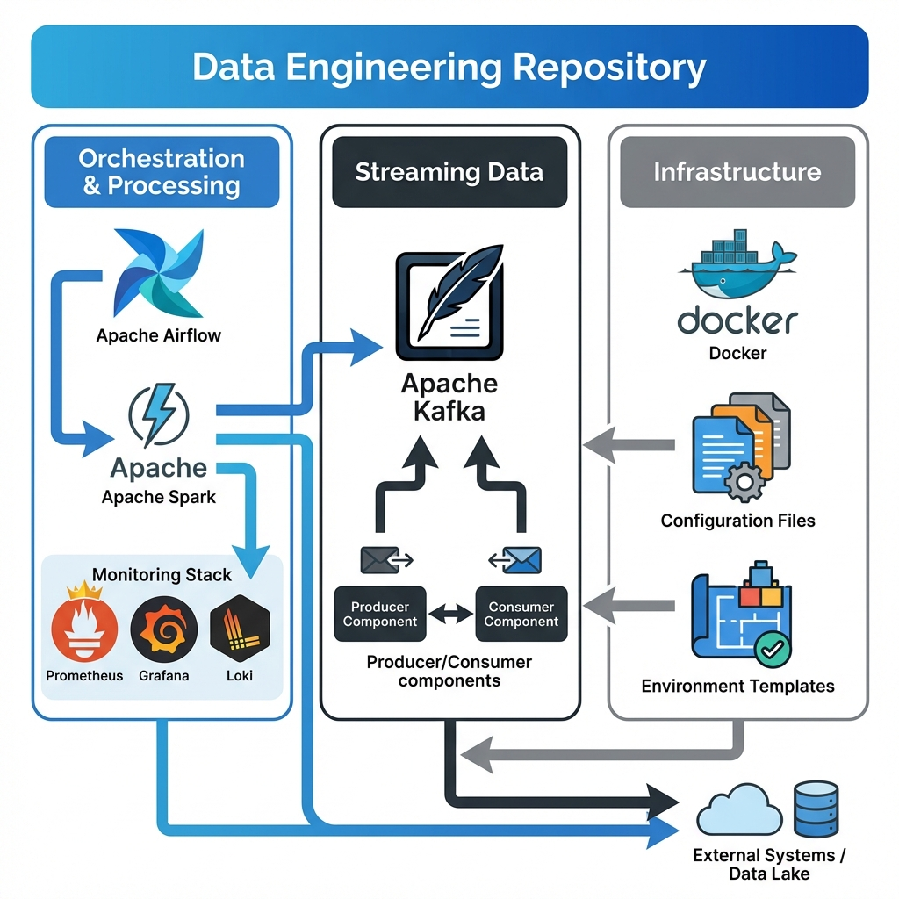
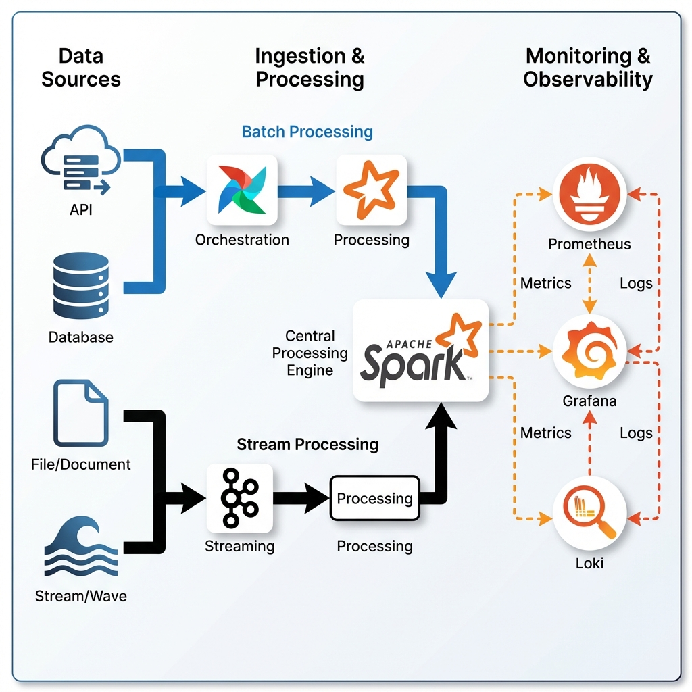

# Data Engineering Projects

Production-grade data engineering repository demonstrating distributed systems, workflow orchestration, event streaming, dimensional data warehouse modeling, and platform observability.

## Architecture

The repository provides modular, reproducible environments demonstrating end-to-end data pipelines from ingestion to analytics and executive visualization.

### Repository Structure

```text
Data-Engineering/
├── .github/workflows/          # CI/CD workflows (dbt validation, Parallax CI)
├── de_projects/
│   ├── airflow_sandbox/        # End-to-end orchestration, Spark compute & observability
│   │   ├── config/             # Prometheus, Grafana dashboards, Loki & Promtail configs
│   │   ├── dags/               # 9 production Airflow DAGs (telemetry, ADT, reporting, audit)
│   │   ├── dbt_project/        # 18 models across Staging, Intermediate, Marts, Reporting
│   │   ├── scripts/            # Synthetic data generation and verification scripts
│   │   └── docker-compose.yaml # Multi-container stack definition
│   └── kafka_projects/
│       └── Kafka_101/          # Python Kafka producer and consumer with key-partitioning
├── docs/images/                # Architectural diagrams
├── Staff_eng_plan/             # Staff Data Engineer 30-day curriculum and study blueprints
├── skills/                     # Engineering behavioral guidelines
├── README.md                   # Repository documentation
└── SECURITY.md                 # Security architecture and deployment policy
```

### System Architecture & Data Flow





1. **Ingestion & Streaming**: Raw telemetry and transactional events ingested via autonomous streaming tasks and Kafka event brokers.
2. **Orchestration**: Apache Airflow schedules time-based feeds, triggers cascading transformations, and monitors dependencies via non-blocking sensors.
3. **Compute & Transformation**: Distributed Spark workers execute batch jobs while dbt-postgres materializes conformed dimensions, star-schema facts, and executive KPI marts.
4. **Observability**: Prometheus captures container and Airflow metrics, Loki aggregates system logs, and Grafana serves pre-configured operational dashboards.

## Projects

### 1. Airflow Sandbox & Clinical Data Platform

A complete healthcare informatics platform running a multi-DAG pipeline and dimensional warehouse for ICU patient operations.

- **Orchestration**: Apache Airflow 2.9.3 (LocalExecutor).
- **Compute**: Apache Spark 3.5.0 cluster (Master and Worker).
- **Warehouse**: PostgreSQL 16 (`healthcare_dwh`) with 18 dbt models spanning 5 lineage tiers.
- **Monitoring**: Prometheus 2.50.1, Grafana 10.4.2, Loki 2.9.4, Promtail 2.9.4, StatsD exporter.

#### Quickstart
```bash
cd de_projects/airflow_sandbox
cp .env.example .env
docker-compose up -d
```

#### Service Endpoints
- Airflow UI: [http://localhost:8080](http://localhost:8080)
- Grafana: [http://localhost:3001](http://localhost:3001)
- Prometheus: [http://localhost:9090](http://localhost:9090)
- Spark Master UI: [http://localhost:8081](http://localhost:8081)
- Clinical Warehouse: `localhost:5433` (database: `healthcare_dwh`)

*Credentials for Airflow, Grafana, and PostgreSQL are configured via your local `.env` file (see `.env.example`).*

Detailed documentation: [de_projects/airflow_sandbox/README.md](./de_projects/airflow_sandbox/README.md)

### 2. Kafka 101: Stream Processing

A foundational implementation demonstrating Apache Kafka message publishing, key-based partitioning, and consumer group offset management in Python.

- **Components**: Producer (`kafka_producer.py`), Consumer (`kafka_consumer.py`), Configuration (`kafka_configurations.py`).
- **Features**: Round-robin and key-hashed partitioning, UTF-8 JSON serialization, configurable broker discovery.

#### Quickstart
```bash
cd de_projects/kafka_projects/Kafka_101
python kafka_consumer.py
python kafka_producer.py
```

Detailed documentation: [de_projects/kafka_projects/Kafka_101/README.md](./de_projects/kafka_projects/Kafka_101/README.md)

### 3. Staff Data Engineer Study Plan

Curriculum and study blueprints covering distributed systems theory (CAP theorem, consensus, replication lag), storage formats (Parquet encoding, predicate pushdown, Iceberg metadata), compute engines (Spark Catalyst, memory tuning), and large-scale data system design.

- [30-Day Study Plan](./Staff_eng_plan/staff_de_30_day_war_plan.md)
- [Day 1: Replication and Parquet Internals](./Staff_eng_plan/day_1_replication_and_parquet.md)
- [Day 2: Partitioning and Parquet Optimization](./Staff_eng_plan/day_2_partitioning_and_parquet.md)

## Technology Stack

- **Workflow Orchestration**: Apache Airflow
- **Distributed Computing**: Apache Spark, PySpark
- **Event Streaming**: Apache Kafka
- **Data Modeling & Transformation**: dbt (Data Build Tool), SQL
- **Database Systems**: PostgreSQL 16
- **Observability**: Prometheus, Grafana, Loki, Promtail, StatsD
- **Infrastructure**: Docker, Docker Compose
- **Programming Languages**: Python 3.11, SQL, Bash

## Security

All projects include sensible local development defaults for ease of testing. When deploying in shared, staging, or production environments, refer to [SECURITY.md](./SECURITY.md) for credential management, network segmentation, and hardening procedures.

## Contributing

1. Fork the repository and create a feature branch (`git checkout -b feature/improvement`).
2. Adhere to code quality and minimal-change principles outlined in [skills/skills.md](./skills/skills.md).
3. Ensure automated verification scripts pass:
   ```bash
   python de_projects/airflow_sandbox/scripts/verify_experiment.py
   ```
4. Submit a Pull Request with a clear explanation of changes and validation steps.

## License

This project is licensed under the terms described in individual subprojects and is available for educational and commercial development.