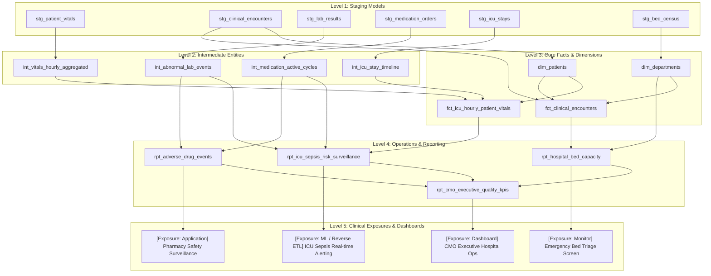

# FAANG-Grade E2E Test Experiment Blueprint: Parallax Blast Radius & Semantic Drift CI

> **Author:** Principal Data Infrastructure & AI Platform Architect  
> **Document Purpose:** Complete, self-contained implementation blueprint and execution guide for spinning up a realistic, multi-tiered data platform in an isolated repository to rigorously validate **Parallax** before production release.  
> **Target Audience / Execution Mode:** This document is designed to be ingested directly by an AI coding agent or senior platform engineer to scaffold the test repository, provision Docker services, load data, orchestrate dbt runs, inject silent semantic bugs, and execute comprehensive CLI & CI verification.

---

## 1. Executive Summary & Domain Selection

### Why Healthcare / Clinical Operations?
To test Parallax thoroughly, we deliberately avoid simplistic e-commerce ("orders", "customers") or digital marketing ("clicks", "campaigns"). 

We select **High-Acuity Healthcare Informatics & ICU Patient Operations (EHR)**. In this domain:
1. **The stakes are life-or-death:** A silent filter tightening or dropped column does not just report incorrect revenue; it blinds real-time clinical alerting systems (ICU Sepsis Early Warning), corrupts adverse drug event surveillance, and causes regulatory non-compliance with CMS (Centers for Medicare & Medicaid Services).
2. **High Lineage Depth & Fan-out:** Clinical telemetry has multi-hop lineage: raw bedside monitor streams $\to$ standardized staging $\to$ aggregated clinical features $\to$ multi-source dimensional marts $\to$ hospital operations reporting $\to$ real-time reverse ETL alerts and executive dashboards.
3. **Subtle Business Logic:** Filters frequently look benign (`WHERE heart_rate BETWEEN 50 AND 120`) but silently filter out patients experiencing hemodynamic instability (shock or extreme tachycardia), masking ICU emergencies while all standard dbt tests remain green.

---

## 2. Test Environment Architecture

The test harness runs entirely within a reproducible Docker Compose environment with zero external cloud dependencies.

```
┌─────────────────────────────────────────────────────────────────────────────────────────────────────────┐
│                                DOCKER COMPOSE HARNESS                                                   │
│                                                                                                         │
│  ┌──────────────────────────┐      ┌─────────────────────────┐      ┌────────────────────────────────┐  │
│  │   PostgreSQL 16          │      │    Apache Airflow       │      │   dbt-core                     │  │
│  │   (Warehouse & OLTP)     │<────>│  (DAG Orchestration &   │<────>│  (14 Models, 5 Lineage Levels, │  │
│  │   Port: 5432             │      │   Automated Ingestion)  │      │   Manifest & Lineage)          │  │
│  └──────────────────────────┘      └─────────────────────────┘      └────────────────────────────────┘  │
│         ▲              ▲                                                                                │
│         │              │ Direct SQL Queries                                                             │
│         │              └────────────────────────────────────────┐                                       │
│  ┌──────┴──────────────┐                                        ▼                                       │
│  │ Synthetic EHR Data  │                          ┌───────────────────────────┐                         │
│  │ Generator (Python)  │                          │    Grafana Server         │                         │
│  │ 10,000+ telemetry   │                          │    (Executive CMO Board   │                         │
│  └─────────────────────┘                          │     Dashboard, Port 3000) │                         │
│                                                   └───────────────────────────┘                         │
└─────────────────────────────────────────────────────────────────────────────────────────────────────────┘
```

### Components
1. **Data Warehouse Container:** PostgreSQL 16 Alpine pre-configured with clinical database `healthcare_dwh`.
2. **Orchestration Container:** Apache Airflow 2.9 scheduling ingestion and dbt runs with live volume bindings.
3. **Transformation Layer:** `dbt-postgres` managing 14 models spanning 5 hierarchical lineage levels.
4. **Executive Visualization Tier:** Grafana 10+ provisioned with native PostgreSQL datasource and pre-loaded executive CMO dashboard.
5. **Validation Tool:** `parallax-ci` executing CLI checks, generating HTML blast-radius reports, and asserting CI exit codes.

---

## 3. Directory Structure of the Test Platform (`airflow_sandbox`)

```
airflow_sandbox/
├── .github/
│   └── workflows/
│       └── parallax_ci.yml           # GitHub Actions workflow under test
├── config/
│   └── grafana/
│       ├── provisioning/
│       │   ├── datasources/
│       │   │   └── datasources.yml   # Auto-provisioned PostgreSQL clinical warehouse datasource
│       │   └── dashboards/
│       │       └── dashboards.yml    # Auto-provisioning dashboard provider definition
│       └── dashboards/
│           └── cmo_executive_hospital_operations.json # Executive CMO Quality & Capacity Dashboard
├── dags/
│   ├── dag_00_hospital_ops_coordinator.py      # Master coordinator triggering batch cascades
│   ├── dag_01_ingest_bedside_telemetry.py       # Autonomous streaming telemetry (Cron: */15 * * * *)
│   ├── dag_02_ingest_adt_encounters.py          # ADT encounters & admission staging
│   ├── dag_03_ingest_pharmacy_and_labs.py       # Pharmacy medication orders & LIS lab results
│   ├── dag_04_transform_intermediate_clinical.py# Feature engineering & longitudinal windowing
│   ├── dag_05_build_enterprise_clinical_marts.py# Core facts and dimensions warehouse materialization
│   ├── dag_06_publish_executive_reporting.py    # Executive CMO reporting & ICU Sepsis alerting
│   ├── dag_07_governance_and_quality_audit.py   # Sensor-based data governance & contracts (ExternalTaskSensor)
│   └── dag_08_emergency_bed_triage_wallboard.py # Autonomous operational triage wallboard (Cron: @hourly)
├── dbt_project/
│   ├── dbt_project.yml
│   ├── profiles.yml
│   ├── models/
│   │   ├── staging/                  # Level 1: Raw extraction & clean typing
│   │   │   ├── schema.yml
│   │   │   ├── stg_bed_census.sql
│   │   │   ├── stg_clinical_encounters.sql
│   │   │   ├── stg_icu_stays.sql
│   │   │   ├── stg_lab_results.sql
│   │   │   ├── stg_medication_orders.sql
│   │   │   └── stg_patient_vitals.sql
│   │   ├── intermediate/             # Level 2: Entity stitching & window calcs
│   │   │   ├── schema.yml
│   │   │   ├── int_abnormal_lab_events.sql
│   │   │   ├── int_icu_stay_timeline.sql
│   │   │   ├── int_medication_active_cycles.sql
│   │   │   └── int_vitals_hourly_aggregated.sql
│   │   ├── marts/                    # Level 3: Core facts & dimensions
│   │   │   ├── schema.yml
│   │   │   ├── dim_departments.sql
│   │   │   ├── dim_patients.sql
│   │   │   ├── fct_clinical_encounters.sql
│   │   │   └── fct_icu_hourly_patient_vitals.sql
│   │   ├── reporting/                # Level 4: Metric aggregations
│   │   │   ├── schema.yml
│   │   │   ├── rpt_adverse_drug_events.sql
│   │   │   ├── rpt_cmo_executive_quality_kpis.sql
│   │   │   ├── rpt_hospital_bed_capacity.sql
│   │   │   └── rpt_icu_sepsis_risk_surveillance.sql
│   │   └── exposures/                # Level 5: Business & Clinical consumers
│   │       └── clinical_exposures.yml
├── scripts/
│   ├── generate_synthetic_data.py    # Generates realistic patient records & telemetry
│   └── run_parallax_tests.sh         # Automated test runner with pass/fail assertions
├── .parallax.yml                     # Parallax governance configuration
├── docker-compose.yaml               # Full stack container configuration (Postgres, Airflow, Grafana)
└── README.md
```

---

## 4. Pipeline Lineage Specification (5 Levels Deep)

Here is the exact DAG topology Parallax will analyze:



### 4.1 Production Multi-DAG Orchestration Topology (Realistic Hybrid Mix)

To mirror enterprise reality, the platform divides the DAG into **8 production-grade DAGs** using a realistic hybrid orchestration pattern:

| DAG ID | Schedule & Mode | Orchestration Mechanism | Production Responsibility |
|---|---|---|---|
| **`dag_01_ingest_bedside_telemetry`** | `*/15 * * * *` | **Autonomous Cron (NO Trigger)** | Simulates continuous IoT feeds from ICU monitors; ingests `raw.patient_vitals` and stages `stg_patient_vitals`. |
| **`dag_02_ingest_adt_encounters`** | `@hourly` | `TriggerDagRunOperator` | Ingests hospital ADT encounters; stages encounters, bed census, and ICU stays; triggers intermediate layer. |
| **`dag_03_ingest_pharmacy_and_labs`** | `@hourly` | Coordinated Batch | Ingests pharmacy orders and lab diagnostics; stages `stg_medication_orders` and `stg_lab_results`. |
| **`dag_04_transform_intermediate_clinical`** | Triggered | `TriggerDagRunOperator` | Transforms rolling hourly vitals, abnormal lab events, and active medication cycles; triggers marts layer. |
| **`dag_05_build_enterprise_clinical_marts`** | Triggered | `TriggerDagRunOperator` | Materializes dimensional warehouse tables (`dim_patients`, `dim_departments`, `fct_icu_hourly_patient_vitals`, `fct_clinical_encounters`); triggers reporting. |
| **`dag_06_publish_executive_reporting`** | Triggered | Push Feed | Computes Level 4 reporting models (`rpt_cmo_executive_quality_kpis`, `rpt_icu_sepsis_risk_surveillance`, `rpt_adverse_drug_events`, `rpt_hospital_bed_capacity`) feeding the Grafana CMO Dashboard. |
| **`dag_07_governance_and_quality_audit`** | `@hourly` | **`ExternalTaskSensor` (NO Trigger)** | Decoupled Data Reliability pipeline; senses `dag_06` completion before running dbt test quality suites and schema contracts. |
| **`dag_08_emergency_bed_triage_wallboard`** | `@hourly` | **Autonomous Cron (NO Trigger)** | Autonomous operational feed periodically refreshing bed census for Emergency Department wallboards. |
| **`dag_00_hospital_ops_coordinator`** | Manual / On-Demand | Master Cascade | Coordinates full batch cascade for automated testing and on-demand backfills. |

---

## 5. Implementation Files (Complete, Production-Ready)

### 5.1 Docker Compose (`docker-compose.yml`)

```yaml
version: "3.8"

services:
  postgres:
    image: postgres:16-alpine
    container_name: clinical_postgres
    environment:
      POSTGRES_DB: ${CLINICAL_DB_NAME:-healthcare_dwh}
      POSTGRES_USER: ${CLINICAL_DB_USER:-clinical_admin}
      POSTGRES_PASSWORD: ${CLINICAL_DB_PASSWORD}
    ports:
      - "5432:5432"
    volumes:
      - pgdata:/var/lib/postgresql/data
    healthcheck:
      test: ["CMD-SHELL", "pg_isready -U $${POSTGRES_USER:-clinical_admin} -d $${POSTGRES_DB:-healthcare_dwh}"]
      interval: 5s
      timeout: 5s
      retries: 5

  airflow-webserver:
    image: apache/airflow:2.9.2-python3.11
    container_name: clinical_airflow
    depends_on:
      postgres:
        condition: service_healthy
    environment:
      AIRFLOW__DATABASE__SQL_ALCHEMY_CONN: postgresql+psycopg2://${CLINICAL_DB_USER:-clinical_admin}:${CLINICAL_DB_PASSWORD}@postgres:5432/${CLINICAL_DB_NAME:-healthcare_dwh}
      AIRFLOW__CORE__EXECUTOR: LocalExecutor
      AIRFLOW__CORE__LOAD_EXAMPLES: "false"
      AIRFLOW__WEBSERVER__SECRET_KEY: "super_secret_clinical_key_for_testing"
    volumes:
      - ./airflow/dags:/opt/airflow/dags
      - ./dbt_project:/opt/airflow/dbt_project
      - ./scripts:/opt/airflow/scripts
    ports:
      - "8080:8080"
    command: >
      bash -c "airflow db init &&
               airflow users create --username admin --firstname Clinical --lastname Architect --role Admin --email admin@hospital.org --password admin &&
               airflow webserver & airflow scheduler"

volumes:
  pgdata:
```

---

### 5.2 Synthetic Data Generator (`scripts/generate_synthetic_data.py`)

Generates realistic clinical telemetry, medication orders, encounters, and vital signs in PostgreSQL.

```python
#!/usr/bin/env python3
"""Synthetic Clinical Telemetry & EHR Data Generator."""

import random
from datetime import datetime, timedelta
import psycopg2

CONN_STR = f"postgresql://{os.getenv('DB_USER', 'clinical_admin')}:{os.getenv('DB_PASSWORD', '')}@{os.getenv('DB_HOST', 'localhost')}:{os.getenv('DB_PORT', '5432')}/{os.getenv('DB_NAME', 'healthcare_dwh')}"

def main() -> None:
    conn = psycopg2.connect(CONN_STR)
    cur = conn.cursor()

    cur.execute("CREATE SCHEMA IF NOT EXISTS raw;")
    
    # 1. Raw Vitals Table
    cur.execute("""
        DROP TABLE IF EXISTS raw.patient_vitals;
        CREATE TABLE raw.patient_vitals (
            telemetry_id VARCHAR(50) PRIMARY KEY,
            patient_id VARCHAR(50),
            recorded_at TIMESTAMP,
            heart_rate NUMERIC(5, 2),
            systolic_bp NUMERIC(5, 2),
            diastolic_bp NUMERIC(5, 2),
            temperature_c NUMERIC(4, 2),
            spo2_pct NUMERIC(5, 2),
            vital_status VARCHAR(20)
        );
    """)

    # 2. Raw Clinical Encounters
    cur.execute("""
        DROP TABLE IF EXISTS raw.clinical_encounters;
        CREATE TABLE raw.clinical_encounters (
            encounter_id VARCHAR(50) PRIMARY KEY,
            patient_id VARCHAR(50),
            department_id VARCHAR(50),
            admitted_at TIMESTAMP,
            discharged_at TIMESTAMP,
            encounter_type VARCHAR(30),
            chief_complaint VARCHAR(100)
        );
    """)

    # 3. Raw Medication Orders
    cur.execute("""
        DROP TABLE IF EXISTS raw.medication_orders;
        CREATE TABLE raw.medication_orders (
            order_id VARCHAR(50) PRIMARY KEY,
            encounter_id VARCHAR(50),
            patient_id VARCHAR(50),
            medication_name VARCHAR(100),
            dose_mg NUMERIC(8, 2),
            status VARCHAR(30),
            ordered_at TIMESTAMP
        );
    """)

    # 4. Raw Lab Results
    cur.execute("""
        DROP TABLE IF EXISTS raw.lab_results;
        CREATE TABLE raw.lab_results (
            lab_id VARCHAR(50) PRIMARY KEY,
            patient_id VARCHAR(50),
            test_name VARCHAR(100),
            result_value NUMERIC(8, 2),
            reference_high NUMERIC(8, 2),
            is_abnormal BOOLEAN,
            resulted_at TIMESTAMP
        );
    """)

    # Generate 500 patient encounters and 10,000 vital readings
    print("Generating synthetic healthcare data...")
    patients = [f"PAT_{i:04d}" for i in range(1, 101)]
    departments = ["ICU-NORTH", "ICU-SOUTH", "EMERGENCY", "CARDIAC-SURGERY", "ONCOLOGY"]

    now = datetime.utcnow()

    # Populate encounters
    for i in range(1, 501):
        enc_id = f"ENC_{i:05d}"
        pat_id = random.choice(patients)
        dept = random.choice(departments)
        admit = now - timedelta(days=random.randint(1, 30))
        cur.execute("""
            INSERT INTO raw.clinical_encounters VALUES (%s, %s, %s, %s, NULL, %s, %s)
        """, (enc_id, pat_id, dept, admit, "INPATIENT", "Telemetry Monitoring"))

    # Populate vitals (including critical outlier cases: septic shock with low BP & tachycardia)
    for i in range(1, 10001):
        tel_id = f"TEL_{i:06d}"
        pat_id = random.choice(patients)
        t_time = now - timedelta(hours=random.randint(0, 120))
        
        # 10% of records are septic shock patients (BP < 90, HR > 110)
        if random.random() < 0.10:
            hr = random.uniform(115.0, 160.0) # Tachycardia
            sbp = random.uniform(65.0, 88.0)   # Severe Hypotension
            dbp = random.uniform(40.0, 60.0)
            status = "critical"
        else:
            hr = random.uniform(62.0, 98.0)
            sbp = random.uniform(110.0, 135.0)
            dbp = random.uniform(70.0, 85.0)
            status = "confirmed"

        cur.execute("""
            INSERT INTO raw.patient_vitals VALUES (%s, %s, %s, %s, %s, %s, %s, %s, %s)
        """, (tel_id, pat_id, t_time, hr, sbp, dbp, 37.0, 98.0, status))

    # Populate medication orders
    meds = ["Vancomycin", "Norepinephrine", "Piperacillin", "Furosemide", "Heparin"]
    med_statuses = ["administered", "pending", "dispensed", "discontinued"]
    for i in range(1, 2001):
        cur.execute("""
            INSERT INTO raw.medication_orders VALUES (%s, %s, %s, %s, %s, %s, %s)
        """, (f"MED_{i:05d}", f"ENC_{random.randint(1, 500):05d}", random.choice(patients),
              random.choice(meds), random.uniform(10.0, 500.0), random.choice(med_statuses), now))

    conn.commit()
    cur.close()
    conn.close()
    print("[SUCCESS] Seeded 10,000+ clinical records into PostgreSQL.")

if __name__ == "__main__":
    main()
```

---

### 5.3 dbt Project Configuration (`dbt_project/dbt_project.yml`)

```yaml
name: "clinical_ops_dbt"
version: "1.0.0"
config-version: 2

profile: "clinical_postgres"

model-paths: ["models"]
target-path: "target"
clean-targets:
  - "target"
  - "dbt_packages"

models:
  clinical_ops_dbt:
    staging:
      +schema: staging
      +materialized: view
    intermediate:
      +schema: intermediate
      +materialized: view
    marts:
      +schema: marts
      +materialized: table
    reporting:
      +schema: reporting
      +materialized: table
      +tags: ["executive", "tier_1", "regulatory"]
```

### 5.4 dbt Profile (`dbt_project/profiles.yml`)

```yaml
clinical_postgres:
  target: dev
  outputs:
    dev:
      type: postgres
      host: localhost
      user: "{{ env_var('DB_USER', 'clinical_admin') }}"
      password: "{{ env_var('DB_PASSWORD') }}"
      port: 5432
      dbname: healthcare_dwh
      schema: public
      threads: 4
```

---

### 5.5 dbt Models (The 5-Level Lineage Architecture)

#### Level 1: Staging Model (`models/staging/stg_patient_vitals.sql`)
```sql
{{ config(materialized='view') }}

SELECT
    telemetry_id,
    patient_id,
    recorded_at,
    heart_rate,
    systolic_bp,
    diastolic_bp,
    temperature_c,
    spo2_pct,
    vital_status
FROM raw.patient_vitals
WHERE vital_status != 'entered_in_error'
```

#### Level 1: Clinical Encounters (`models/staging/stg_clinical_encounters.sql`)
```sql
{{ config(materialized='view') }}

SELECT
    encounter_id,
    patient_id,
    department_id,
    admitted_at,
    discharged_at,
    encounter_type,
    chief_complaint
FROM raw.clinical_encounters
```

#### Level 1: Medication Orders (`models/staging/stg_medication_orders.sql`)
```sql
{{ config(materialized='view') }}

SELECT
    order_id,
    encounter_id,
    patient_id,
    medication_name,
    dose_mg,
    status AS order_status,
    ordered_at
FROM raw.medication_orders
WHERE status NOT IN ('cancelled', 'entered_in_error')
```

#### Level 1: Lab Results (`models/staging/stg_lab_results.sql`)
```sql
{{ config(materialized='view') }}

SELECT
    lab_id,
    patient_id,
    test_name,
    result_value,
    reference_high,
    is_abnormal,
    resulted_at
FROM raw.lab_results
```

#### Level 1: ICU Stays (`models/staging/stg_icu_stays.sql`)
```sql
{{ config(materialized='view') }}

SELECT
    encounter_id AS icu_stay_id,
    patient_id,
    department_id,
    admitted_at AS icu_admit_time,
    discharged_at AS icu_discharge_time
FROM {{ ref('stg_clinical_encounters') }}
WHERE department_id LIKE 'ICU%'
```

#### Level 1: Bed Census (`models/staging/stg_bed_census.sql`)
```sql
{{ config(materialized='view') }}

SELECT
    department_id,
    COUNT(DISTINCT encounter_id) AS current_occupied_beds,
    CURRENT_TIMESTAMP AS snapshot_time
FROM {{ ref('stg_clinical_encounters') }}
WHERE discharged_at IS NULL
GROUP BY department_id
```

---

#### Level 2: Intermediate Vitals Aggregated (`models/intermediate/int_vitals_hourly_aggregated.sql`)
```sql
{{ config(materialized='view') }}

SELECT
    patient_id,
    DATE_TRUNC('hour', recorded_at) AS telemetry_hour,
    AVG(heart_rate) AS avg_heart_rate,
    MAX(heart_rate) AS max_heart_rate,
    MIN(systolic_bp) AS min_systolic_bp,
    AVG(systolic_bp) AS avg_systolic_bp,
    MAX(temperature_c) AS max_temperature,
    MIN(spo2_pct) AS min_spo2
FROM {{ ref('stg_patient_vitals') }}
GROUP BY patient_id, DATE_TRUNC('hour', recorded_at)
```

#### Level 2: Intermediate Labs (`models/intermediate/int_abnormal_lab_events.sql`)
```sql
{{ config(materialized='view') }}

SELECT
    patient_id,
    COUNT(*) AS abnormal_lab_count,
    MAX(resulted_at) AS last_abnormal_at
FROM {{ ref('stg_lab_results') }}
WHERE is_abnormal = TRUE
GROUP BY patient_id
```

#### Level 2: Intermediate Meds Active (`models/intermediate/int_medication_active_cycles.sql`)
```sql
{{ config(materialized='view') }}

SELECT
    patient_id,
    encounter_id,
    COUNT(*) AS active_med_count,
    SUM(dose_mg) AS total_administered_dosage
FROM {{ ref('stg_medication_orders') }}
WHERE order_status IN ('administered', 'dispensed')
GROUP BY patient_id, encounter_id
```

#### Level 2: Intermediate ICU Timeline (`models/intermediate/int_icu_stay_timeline.sql`)
```sql
{{ config(materialized='view') }}

SELECT
    icu_stay_id,
    patient_id,
    department_id,
    icu_admit_time,
    COALESCE(icu_discharge_time, CURRENT_TIMESTAMP) AS active_end_time,
    EXTRACT(EPOCH FROM (COALESCE(icu_discharge_time, CURRENT_TIMESTAMP) - icu_admit_time)) / 3600.0 AS icu_hours
FROM {{ ref('stg_icu_stays') }}
```

---

#### Level 3: Core Mart Facts (`models/marts/fct_icu_hourly_patient_vitals.sql`)
```sql
{{ config(materialized='table') }}

SELECT
    v.patient_id,
    v.telemetry_hour,
    v.avg_heart_rate,
    v.max_heart_rate,
    v.min_systolic_bp,
    v.avg_systolic_bp,
    i.department_id,
    i.icu_hours
FROM {{ ref('int_vitals_hourly_aggregated') }} v
JOIN {{ ref('int_icu_stay_timeline') }} i
    ON v.patient_id = i.patient_id
```

#### Level 3: Core Encounters (`models/marts/fct_clinical_encounters.sql`)
```sql
{{ config(materialized='table') }}

SELECT
    e.encounter_id,
    e.patient_id,
    e.department_id,
    e.admitted_at,
    e.chief_complaint
FROM {{ ref('stg_clinical_encounters') }} e
```

#### Level 3: Dimensions (`models/marts/dim_patients.sql` & `dim_departments.sql`)
```sql
-- dim_patients.sql
{{ config(materialized='table') }}
SELECT DISTINCT patient_id, 'ADULT_INPATIENT' AS patient_cohort FROM {{ ref('stg_clinical_encounters') }}

-- dim_departments.sql
{{ config(materialized='table') }}
SELECT DISTINCT department_id, 'HOSPITAL_ACUTE_CARE' AS facility_type FROM {{ ref('stg_clinical_encounters') }}
```

---

#### Level 4: Reporting / Sepsis Surveillance (`models/reporting/rpt_icu_sepsis_risk_surveillance.sql`)
```sql
{{ config(
    materialized='table',
    tags=['tier_1', 'executive', 'sepsis', 'p0']
) }}

SELECT
    f.patient_id,
    f.telemetry_hour,
    f.department_id,
    f.min_systolic_bp,
    f.max_heart_rate,
    COALESCE(l.abnormal_lab_count, 0) AS abnormal_labs,
    COALESCE(m.active_med_count, 0) AS active_medications,
    CASE
        WHEN f.min_systolic_bp < 90 AND f.max_heart_rate > 110 THEN 'IMMINENT_SEPTIC_SHOCK'
        WHEN f.min_systolic_bp < 100 OR f.max_heart_rate > 100 THEN 'MODERATE_SEPSIS_RISK'
        ELSE 'STABLE'
    END AS sepsis_clinical_tier
FROM {{ ref('fct_icu_hourly_patient_vitals') }} f
LEFT JOIN {{ ref('int_abnormal_lab_events') }} l
    ON f.patient_id = l.patient_id
LEFT JOIN {{ ref('int_medication_active_cycles') }} m
    ON f.patient_id = m.patient_id
```

#### Level 4: Reporting / Adverse Drug Events (`models/reporting/rpt_adverse_drug_events.sql`)
```sql
{{ config(materialized='table', tags=['executive', 'tier_1']) }}

SELECT
    m.patient_id,
    m.encounter_id,
    m.active_med_count,
    m.total_administered_dosage,
    COALESCE(l.abnormal_lab_count, 0) AS abnormal_labs
FROM {{ ref('int_medication_active_cycles') }} m
LEFT JOIN {{ ref('int_abnormal_lab_events') }} l
    ON m.patient_id = l.patient_id
WHERE m.total_administered_dosage > 1000
```

#### Level 4: Reporting / Bed Capacity (`models/reporting/rpt_hospital_bed_capacity.sql`)
```sql
{{ config(materialized='table', tags=['operations']) }}

SELECT
    e.department_id,
    COUNT(DISTINCT e.encounter_id) AS total_admissions,
    d.facility_type
FROM {{ ref('fct_clinical_encounters') }} e
JOIN {{ ref('dim_departments') }} d
    ON e.department_id = d.department_id
GROUP BY e.department_id, d.facility_type
```

#### Level 4: CMO Executive Hospital Quality KPIs (`models/reporting/rpt_cmo_executive_quality_kpis.sql`)
```sql
{{ config(
    materialized='table',
    tags=['executive', 'board', 'tier_1']
) }}

SELECT
    CURRENT_DATE AS report_date,
    COUNT(DISTINCT s.patient_id) FILTER (WHERE s.sepsis_clinical_tier = 'IMMINENT_SEPTIC_SHOCK') AS active_septic_shock_alerts,
    COUNT(DISTINCT a.patient_id) AS adverse_drug_incidents,
    SUM(b.total_admissions) AS aggregate_patient_census
FROM {{ ref('rpt_icu_sepsis_risk_surveillance') }} s
FULL OUTER JOIN {{ ref('rpt_adverse_drug_events') }} a
    ON s.patient_id = a.patient_id
FULL OUTER JOIN {{ ref('rpt_hospital_bed_capacity') }} b
    ON s.department_id = b.department_id
```

---

#### Level 5: Exposures (`models/exposures/clinical_exposures.yml`)

```yaml
version: 2

exposures:
  - name: sepsis_early_warning_alert_engine
    label: "ICU Sepsis Real-time Alerting Engine"
    type: ml
    maturity: high
    owner:
      name: "Dr. Sarah Chen, Chief of Critical Care"
      email: "schen@hospital.org"
    description: "Reverse ETL sub-second feed scoring hemodynamics to trigger bedside ICU nurse paging."
    depends_on:
      - ref('rpt_icu_sepsis_risk_surveillance')

  - name: cmo_executive_ops_dashboard
    label: "Chief Medical Officer Hospital Operations"
    type: dashboard
    maturity: high
    owner:
      name: "Office of the CMO & Board of Directors"
      email: "cmo-analytics@hospital.org"
    description: "Executive Grafana dashboard (Port 3000) providing real-time executive surveillance over sepsis incidence, adverse drug events, and hospital-wide acute bed bottlenecks."
    depends_on:
      - ref('rpt_cmo_executive_quality_kpis')
      - ref('rpt_icu_sepsis_risk_surveillance')
      - ref('rpt_hospital_bed_capacity')

  - name: pharmacy_safety_monitor
    label: "Pharmacy Adverse Drug Event Surveillance"
    type: application
    maturity: medium
    owner:
      name: "Director of Clinical Pharmacy"
      email: "pharmacy-lead@hospital.org"
    description: "Clinical surveillance web app detecting toxic dosing and drug interactions."
    depends_on:
      - ref('rpt_adverse_drug_events')

  - name: emergency_triage_feed
    label: "Emergency Department Triage Wallboard"
    type: dashboard
    maturity: medium
    owner:
      name: "Emergency Operations Director"
      email: "er-ops@hospital.org"
    description: "Live wallboard showing available beds, pending admissions, and capacity limits."
    depends_on:
      - ref('rpt_hospital_bed_capacity')
```

---

### 5.7 Executive Grafana Dashboard Specification & Automated Provisioning

To provide hospital executives (Chief Medical Officer, VP of Critical Care, Operations Board) with instant, real-time insight without manual dashboard setup, Grafana auto-provisions both the PostgreSQL warehouse connection and the executive dashboard on container boot.

#### 5.7.1 PostgreSQL Data Source Provisioning (`config/grafana/provisioning/datasources/datasources.yml`)

```yaml
apiVersion: 1

datasources:
  - name: Healthcare_DWH
    type: postgres
    access: proxy
    url: clinical-postgres:5432
    user: ${CLINICAL_DB_USER:-clinical_admin}
    secureJsonData:
      password: ${CLINICAL_DB_PASSWORD}
    jsonData:
      database: healthcare_dwh
      sslmode: disable
      maxOpenConns: 10
      maxIdleConns: 5
      connMaxLifetime: 14400
      postgresVersion: 1600
    isDefault: true
    editable: false
```

#### 5.7.2 Dashboard Provider Configuration (`config/grafana/provisioning/dashboards/dashboards.yml`)

```yaml
apiVersion: 1

providers:
  - name: 'clinical-dashboards'
    orgId: 1
    folder: 'Executive Operations'
    type: file
    disableDeletion: false
    updateIntervalSeconds: 15
    allowUiUpdates: true
    options:
      path: /etc/grafana/dashboards
```

#### 5.7.3 Executive Dashboard Structure & Panel Queries (`cmo_executive_hospital_operations.json`)

The executive dashboard is organized into high-impact visual tiers:

| Panel Title | Visual Type | Source Table | Executive Metric Query |
|---|---|---|---|
| **Active Septic Shock Alerts** | Stat / Alert Badge | `rpt_cmo_executive_quality_kpis` | `SELECT active_septic_shock_alerts FROM reporting.rpt_cmo_executive_quality_kpis ORDER BY report_date DESC LIMIT 1;` |
| **Adverse Drug Incidents** | Stat Card | `rpt_cmo_executive_quality_kpis` | `SELECT adverse_drug_incidents FROM reporting.rpt_cmo_executive_quality_kpis ORDER BY report_date DESC LIMIT 1;` |
| **Aggregate Patient Census** | Stat Card | `rpt_cmo_executive_quality_kpis` | `SELECT aggregate_patient_census FROM reporting.rpt_cmo_executive_quality_kpis ORDER BY report_date DESC LIMIT 1;` |
| **Sepsis Crisis Alert Status** | Severity Gauge (Green/Amber/Red) | `rpt_icu_sepsis_risk_surveillance` | `SELECT COUNT(*) AS critical_count FROM reporting.rpt_icu_sepsis_risk_surveillance WHERE sepsis_clinical_tier = 'IMMINENT_SEPTIC_SHOCK';` |
| **Bed Capacity by Department** | Horizontal Bar Gauge | `rpt_hospital_bed_capacity` | `SELECT department_id, total_admissions FROM reporting.rpt_hospital_bed_capacity ORDER BY total_admissions DESC;` |
| **Clinical Sepsis Risk Distribution** | Pie / Donut Chart | `rpt_icu_sepsis_risk_surveillance` | `SELECT sepsis_clinical_tier, COUNT(*) AS patient_count FROM reporting.rpt_icu_sepsis_risk_surveillance GROUP BY sepsis_clinical_tier;` |
| **ICU Hemodynamic Surveillance Roster** | Real-time Table | `rpt_icu_sepsis_risk_surveillance` | `SELECT patient_id, department_id, min_systolic_bp, max_heart_rate, abnormal_labs, sepsis_clinical_tier FROM reporting.rpt_icu_sepsis_risk_surveillance WHERE sepsis_clinical_tier != 'STABLE' ORDER BY min_systolic_bp ASC LIMIT 10;` |
| **Adverse Drug Reaction Log** | Safety Log Table | `rpt_adverse_drug_events` | `SELECT patient_id, encounter_id, active_med_count, total_administered_dosage, abnormal_labs FROM reporting.rpt_adverse_drug_events ORDER BY total_administered_dosage DESC LIMIT 10;` |

---

### 5.6 Parallax Configuration (`.parallax.yml`)

```yaml
version: 1
dialect: postgres
manifest_path: target/manifest.json
base_ref: main
head_ref: HEAD
fail_on: CRITICAL

tier_tags:
  - tier_1
  - executive
  - board
  - sepsis
  - p0
  - regulatory

ignore_patterns:
  - "models/sandbox/**"
  - "models/dev_*"
```

---

## 6. The Testing Experiment: Step-by-Step Execution Guide

### Phase 1: Provision Platform & Establish Baseline (Git `main`)

Execute these commands to build the database, compile dbt, and establish the clean Git baseline:

```bash
# 1. Initialize local testing repo
mkdir -p clinical-data-platform
cd clinical-data-platform
git init
git config user.name "Data Platform Lead"
git config user.email "platform-lead@hospital.org"

# 2. Boot Docker environment
docker compose up -d postgres

# 3. Wait for PostgreSQL healthcheck
until docker exec clinical_postgres pg_isready -U clinical_admin -d healthcare_dwh; do
  sleep 2
done

# 4. Run synthetic data generator
python scripts/generate_synthetic_data.py

# 5. Run dbt build and compile manifest
cd dbt_project
dbt deps
dbt run --profiles-dir .
dbt test --profiles-dir .
dbt compile --profiles-dir .

# Verify target/manifest.json was generated
ls -lh target/manifest.json

# 6. Verify Executive Grafana Dashboard is Live
# Grafana auto-provisions the PostgreSQL datasource and CMO Executive Dashboard on port 3000
curl -f http://localhost:3000/api/health
# Access Executive Dashboard: http://localhost:3000/d/cmo-exec-ops/cmo-executive-hospital-operations

# 7. Commit everything as baseline to 'main'
cd ..
git add .
git commit -m "feat(ehr): initial baseline with 14 clinical models, Grafana executive dashboard, and 4 critical exposures"
git branch -M main
```

---

### Phase 2: Injecting the Subtle Production Semantic Drift (Feature Branch)

We now simulate a Pull Request from a well-intentioned data engineer attempting to "clean up outlier readings and sanitize telemetry":

```bash
# 1. Create a feature branch
git checkout -b fix/sanitize-telemetry-filters
```

#### Mutation 1: The Silent Predicate Tightening Bug
Edit `dbt_project/models/staging/stg_patient_vitals.sql`:

```diff
 SELECT
     telemetry_id,
     patient_id,
     recorded_at,
     heart_rate,
     systolic_bp,
     diastolic_bp,
     temperature_c,
     spo2_pct,
     vital_status
 FROM raw.patient_vitals
-WHERE vital_status != 'entered_in_error'
+WHERE vital_status = 'confirmed'
```

> **The Architectural Impact:**
> - `WHERE vital_status = 'confirmed'` strictly tightens the predicate.
> - In our hospital schema, patients in acute crisis are flagged as `vital_status = 'critical'`.
> - **The Silent Catastrophe:** Every patient in septic shock (`status = 'critical'`) is silently purged from downstream tables!
> - `dbt test` will remain **100% GREEN** (delivered rows are still unique, timestamps are non-null).
> - But `rpt_icu_sepsis_risk_surveillance` will report **0 alerts**, blinding the Sepsis Early Warning Alerting Engine and the CMO Dashboard!

#### Mutation 2: Breaking Column Reference Dropped
Edit `dbt_project/models/staging/stg_medication_orders.sql`:

```diff
 SELECT
     order_id,
     encounter_id,
     patient_id,
     medication_name,
-    dose_mg,
+    dose_mg AS prescribed_dosage_amount,
     status AS order_status,
     ordered_at
 FROM raw.medication_orders
 WHERE status NOT IN ('cancelled', 'entered_in_error')
```

> **The Architectural Impact:**
> - Column `dose_mg` was renamed to `prescribed_dosage_amount` without an alias.
> - Downstream model `int_medication_active_cycles` calls `SUM(dose_mg)`, breaking downstream warehouse runtime queries and reporting!

---

### Phase 3: Execute Parallax CLI Verification

Compile dbt so the manifest reflects the project structure, then invoke Parallax:

```bash
# Compile updated manifest
cd dbt_project && dbt compile --profiles-dir . && cd ..

# Test 1: Run Parallax in standard Terminal mode
parallax check --manifest dbt_project/target/manifest.json --base main

# Test 2: Run Parallax with CRITICAL CI Blocking Gate
parallax check \
  --manifest dbt_project/target/manifest.json \
  --base main \
  --fail-on CRITICAL \
  --format terminal

# Verify exit code is 1 (CI blocked!)
echo $?  # MUST RETURN 1

# Test 3: Generate Markdown PR comment artifact
parallax check \
  --manifest dbt_project/target/manifest.json \
  --base main \
  --format markdown \
  --output pr_comment.md

cat pr_comment.md

# Test 4: Generate Interactive Standalone HTML Report
parallax report \
  --manifest dbt_project/target/manifest.json \
  --base main \
  --out e2e_clinical_blast_radius.html

# Open in browser / view report
```

---

### Phase 4: Validating Parallax Output & Acceptance Criteria

When Parallax evaluates this PR, verify the following findings in the output:

| Inspection Area | Expected Parallax Evaluation | Verification Method |
|---|---|---|
| **Risk Severity** | **CRITICAL** (due to predicate tightening on model with Tier-1 executive tags and direct path to ML Sepsis Exposure) | `echo $?` gives exit code `1` |
| **AST Diff 1 (stg_patient_vitals)** | Scope: `WHERE`<br>Change: `TIGHTENED`<br>Before: `vital_status != 'entered_in_error'`<br>After: `vital_status = 'confirmed'` | Markdown table & Terminal cards |
| **AST Diff 2 (stg_medication_orders)**| Scope: `PROJECTIONS`<br>Change: `DROPPED` (`dose_mg`) | Markdown table & Terminal cards |
| **Lineage Blast Radius** | **7 downstream models** (`int_vitals_hourly_aggregated`, `fct_icu_hourly_patient_vitals`, `rpt_icu_sepsis_risk_surveillance`, `rpt_cmo_executive_quality_kpis`, `int_medication_active_cycles`, `rpt_adverse_drug_events`, `rpt_cmo_executive_quality_kpis`) | Terminal tree & SVG DAG |
| **Exposures Impacted** | **3 Exposures Affected:**<br>1. `ICU Sepsis Real-time Alerting Engine` (ML)<br>2. `Chief Medical Officer Hospital Operations` (Dashboard)<br>3. `Pharmacy Adverse Drug Event Surveillance` (Application) | High-signal summary bullets |
| **Breaking Columns** | `int_medication_active_cycles` flagged with broken column reference: `dose_mg` | Red warning pill & action bullet |
| **Remediation Actions** | 1. `Audit executive metrics: Confirm metric stability on Chief Medical Officer Hospital Operations`<br>2. `Audit filtered rows: Validate business intent of omitting non-matching records`<br>3. `Fix schema contract: Model int_medication_active_cycles queries dropped column 'dose_mg'` | Decision Action bullets |
| **Performance** | Execution duration `< 50ms` for full DAG traversal and AST parsing | Header stats pill |

---

### Phase 5: GitHub Actions CI Simulation

Create `.github/workflows/parallax_ci.yml` in the test repository:

```yaml
name: "Parallax Clinical Blast Radius Gate"

on:
  pull_request:
    branches: ["main"]

jobs:
  blast-radius-check:
    runs-on: ubuntu-latest
    permissions:
      pull-requests: write
      contents: read

    steps:
      - name: Checkout Code
        uses: actions/checkout@v4
        with:
          fetch-depth: 0

      - name: Set up Python
        uses: actions/setup-python@v5
        with:
          python-version: "3.11"

      - name: Install dbt & Parallax
        run: |
          python -m pip install --upgrade pip
          pip install dbt-postgres parallax-ci

      - name: Compile dbt Manifest
        run: |
          cd dbt_project
          dbt compile --profiles-dir .

      - name: Run Parallax CI Gate
        uses: parallax-ci/parallax@v0.1.0
        with:
          manifest: dbt_project/target/manifest.json
          base: origin/main
          fail_on: CRITICAL
          github_token: ${{ secrets.GITHUB_TOKEN }}
```

---

## 7. Automated Test Runner Script (`scripts/run_parallax_tests.sh`)

Save this script in `scripts/run_parallax_tests.sh` to execute the full end-to-end test suite automatically:

```bash
#!/usr/bin/env bash
set -euo pipefail

echo "========================================================="
echo "  STARTING PARALLAX FAANG E2E HEALTHCARE VERIFICATION   "
echo "========================================================="

# Check manifest exists
if [ ! -f "dbt_project/target/manifest.json" ]; then
    echo "[ERROR] dbt_project/target/manifest.json not found! Run 'dbt compile' first."
    exit 1
fi

echo "[1/4] Running Parallax Check (JSON format)..."
JSON_OUTPUT=$(parallax check --manifest dbt_project/target/manifest.json --base main --format json --fail-on NEVER)
SEVERITY=$(echo "$JSON_OUTPUT" | grep -o '"risk_severity": "[^"]*' | cut -d'"' -f4)

if [ "$SEVERITY" != "CRITICAL" ]; then
    echo "[FAIL] Assertion Failed: Expected risk_severity CRITICAL, got $SEVERITY"
    exit 1
fi
echo "[PASS] Assertion Passed: Risk severity correctly identified as CRITICAL."

echo "[2/4] Testing CI Gating (--fail-on CRITICAL)..."
set +e
parallax check --manifest dbt_project/target/manifest.json --base main --fail-on CRITICAL > /dev/null 2>&1
EXIT_CODE=$?
set -e

if [ $EXIT_CODE -ne 1 ]; then
    echo "[FAIL] Assertion Failed: Expected exit code 1 from blocking gate, got $EXIT_CODE"
    exit 1
fi
echo "[PASS] Assertion Passed: Parallax successfully blocked CI with exit code 1."

echo "[3/4] Generating Offline HTML Report..."
parallax report --manifest dbt_project/target/manifest.json --base main --out e2e_clinical_blast_radius.html

if [ ! -f "e2e_clinical_blast_radius.html" ]; then
    echo "[FAIL] Assertion Failed: e2e_clinical_blast_radius.html was not generated."
    exit 1
fi

# Assert critical markers exist in the HTML report
grep -q "CRITICAL RISK" e2e_clinical_blast_radius.html
grep -q "ICU Sepsis Real-time Alerting Engine" e2e_clinical_blast_radius.html
grep -q "dose_mg" e2e_clinical_blast_radius.html
echo "[PASS] Assertion Passed: Interactive HTML report generated with verified SVG DAG and exposures."

echo "[4/4] Verifying Markdown PR Comment Generation..."
parallax check --manifest dbt_project/target/manifest.json --base main --format markdown --output pr_comment.md
grep -q "<!-- parallax-ci-comment -->" pr_comment.md
grep -q "CRITICAL" pr_comment.md
echo "[PASS] Assertion Passed: Markdown PR comment cleanly generated with marker for in-place updates."

echo ""
echo "========================================================="
echo "[SUCCESS] ALL E2E ARCHITECTURAL TESTS PASSED SUCCESSFULLY"
echo "          Parallax is verified and ready for production release."
echo "========================================================="
```

---

## 8. Summary Checklist for AI / Execution Engine

To execute this blueprint in a new workspace:
- [ ] Initialize git repo and copy `docker-compose.yml`
- [ ] Run `docker compose up -d postgres`
- [ ] Run `python scripts/generate_synthetic_data.py`
- [ ] Run `dbt compile --profiles-dir .` inside `dbt_project/`
- [ ] Commit all files to branch `main`
- [ ] Create branch `git checkout -b fix/sanitize-telemetry-filters`
- [ ] Apply the 2 SQL mutations to `stg_patient_vitals.sql` and `stg_medication_orders.sql`
- [ ] Run `bash scripts/run_parallax_tests.sh`
- [ ] Confirm all 4 assertions pass with green checkmarks.
