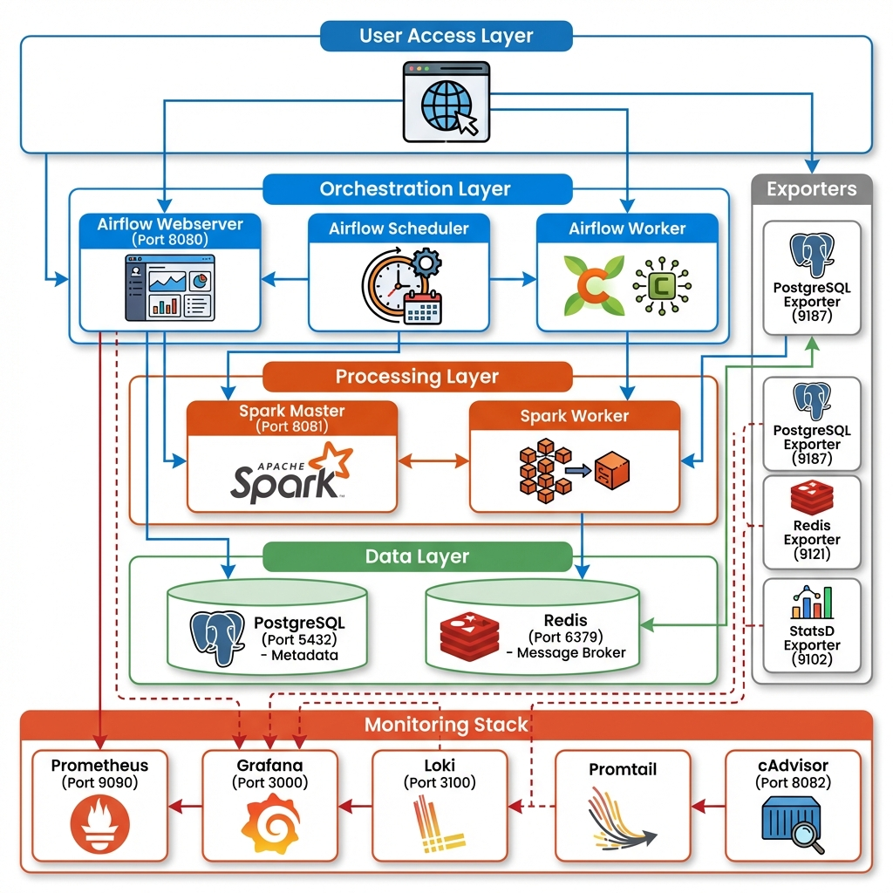

# Airflow Sandbox with Spark

## Objective

This project provides a self-contained development environment for running Apache Airflow with a distributed Apache Spark cluster. It is designed to be an easy-to-use sandbox for developing, testing, and running data pipelines that leverage the power of Spark for distributed data processing, orchestrated by Airflow.

The key goals of this project are:
- To provide a one-command setup for a complete Airflow and Spark environment.
- To demonstrate how to integrate Airflow with Spark for running PySpark jobs.
- To offer a starting point for building more complex data engineering projects.

## Architecture

The environment is orchestrated using `docker-compose` and consists of the following services:



The architecture is organized into five layers:

1. **User Access Layer**: Web browser access to all UIs
2. **Orchestration Layer** (Blue): Airflow Webserver, Scheduler, and Worker
3. **Processing Layer** (Orange): Spark Master and Worker
4. **Data Layer** (Green): PostgreSQL (metadata) and Redis (message broker)
5. **Monitoring Stack** (Red/Orange): Prometheus, Grafana, Loki, Promtail, cAdvisor
6. **Exporters** (Gray): PostgreSQL, Redis, and StatsD exporters for metrics

### Components

-   **Airflow**:
    -   `airflow-webserver`: The Airflow UI, accessible at `http://localhost:8080`.
    -   `airflow-scheduler`: Responsible for scheduling and triggering DAGs.
    -   `airflow-worker`: A Celery worker that executes the tasks defined in the DAGs.
-   **Spark**:
    -   `spark-master`: The master node of the Spark cluster. Its UI is available at `http://localhost:8081`.
    -   `spark-worker`: A worker node that performs the actual data processing.
-   **Supporting Services**:
    -   `postgres`: A PostgreSQL database used by Airflow to store its metadata.
    -   `redis`: A Redis instance that acts as a message broker for the CeleryExecutor.
-   **Monitoring Stack** (Lightweight):
    -   `prometheus`: Metrics collection and storage at `http://localhost:9090`.
    -   `grafana`: Visualization dashboards at `http://localhost:3000` (admin/admin).
    -   `loki`: Log aggregation service at `http://localhost:3100`.
    -   `promtail`: Log shipping agent (collects logs from all containers).
    -   `cadvisor`: Container metrics at `http://localhost:8082`.
    -   `postgres-exporter`: PostgreSQL metrics exporter.
    -   `redis-exporter`: Redis metrics exporter.
    -   `statsd-exporter`: Airflow StatsD metrics exporter.

## How to Run

### Prerequisites

-   Docker
-   Docker Compose

### 1. Start the Environment

To start all the services in detached mode, run the following command from the `airflow_sandbox` directory:

```bash
docker-compose up -d
```

### 2. Access the Services

> [!NOTE]
> **Default Credentials for Development**
> 
> This sandbox uses default credentials for ease of local development. For production deployments, see the [Security Guide](../../SECURITY.md).

-   **Airflow UI**: Open your web browser and navigate to `http://localhost:8080`.
    -   **Username**: `admin`
    -   **Password**: See `docker-compose.yaml` or use `.env` file
-   **Spark Master UI**: Open your web browser and navigate to `http://localhost:8081`.
-   **Grafana (Monitoring Dashboards)**: Navigate to `http://localhost:3000`.
    -   **Username**: `admin`
    -   **Password**: See `docker-compose.yaml` or use `.env` file
-   **Prometheus (Metrics)**: Navigate to `http://localhost:9090`.
-   **cAdvisor (Container Metrics)**: Navigate to `http://localhost:8082`.

**To change default passwords:**
1. Copy `.env.example` to `.env`
2. Update passwords in `.env` file
3. Run `docker-compose --env-file .env up -d`

### 3. Running the Example DAG

The project comes with an example DAG called `spark_data_pipeline`. This DAG demonstrates how to run a PySpark job from Airflow.

1.  In the Airflow UI, you should see the `spark_data_pipeline` DAG.
2.  Enable the DAG by clicking the toggle switch next to its name.
3.  The DAG will run based on its schedule (`@daily`), or you can trigger it manually by clicking the "play" button.

The DAG has two tasks that run the same Spark job (`pyspark_sample.py`) in two different ways:
-   `spark_bash_local_mode`: Uses a `BashOperator` to execute `spark-submit`.
-   `spark_operator_local_mode`: Uses the `SparkSubmitOperator`.

### 4. Stop the Environment

To stop all the services, run:

```bash
docker-compose down
```

To stop the services and remove all volumes (this will delete the Airflow metadata and logs), run:

```bash
docker-compose down -v
```

## Monitoring & Observability

The environment includes a **lightweight monitoring stack** designed for fast startup (<60s) and minimal resource usage (<2GB RAM, <5GB disk).

### Available Dashboards

Access Grafana at `http://localhost:3000` (admin/admin) to view:

1. **Infrastructure Overview**
   - Real-time service status (UP/DOWN)
   - Container CPU and memory usage
   - System-wide resource consumption

2. **Airflow Monitoring** (via StatsD metrics)
   - DAG run statistics
   - Task execution metrics
   - Scheduler performance
   - Worker resource usage

3. **Spark Cluster Monitoring**
   - Master and worker status
   - Job execution metrics
   - Resource allocation

4. **Database & Cache**
   - PostgreSQL connection pool, queries/sec
   - Redis memory usage, hit/miss ratio

### Metrics Collection

**Prometheus** (`http://localhost:9090`) collects metrics from:
- All Docker containers (via cAdvisor)
- PostgreSQL database (via postgres-exporter)
- Redis cache (via redis-exporter)
- Airflow services (via statsd-exporter)

**Retention**: 15 days

### Log Aggregation

**Loki** (`http://localhost:3100`) aggregates logs from all containers via Promtail.

**Query logs in Grafana**:
1. Go to Explore
2. Select "Loki" data source
3. Use LogQL queries, e.g., `{service="airflow-worker"}`

**Retention**: 7 days

### Alerting

Prometheus monitors critical metrics and triggers alerts for:
- Service down (any container stops)
- High CPU usage (>85% for 5 minutes)
- High memory usage (>85% for 5 minutes)
- Database connection issues
- Cache unavailability

View active alerts in Prometheus at `http://localhost:9090/alerts`.

### Resource Usage

The monitoring stack adds approximately:
- **RAM**: 1.5-2GB
- **Disk**: 3-5GB (with 7-15 day retention)
- **Startup time**: 30-60 seconds
- **Containers**: +8

### Customization

- **Prometheus config**: `config/prometheus/prometheus.yml`
- **Alert rules**: `config/prometheus/alerts.yml`
- **Loki config**: `config/loki/loki-config.yml`
- **Grafana dashboards**: `config/grafana/dashboards/`

## Common Issues and Fixes

-   **Issue**: Airflow UI is not accessible at `http://localhost:8080`.
    -   **Fix**: Check the logs of the `airflow-webserver` container for errors: `docker-compose logs -f airflow-webserver`. It might take a few minutes for the webserver to start up, especially on the first run.

-   **Issue**: The `spark_data_pipeline` DAG is not visible in the Airflow UI.
    -   **Fix**: Check the logs of the `airflow-scheduler` container: `docker-compose logs -f airflow-scheduler`. Ensure there are no errors in the DAG file (`dags/spark_pipeline.py`).

-   **Issue**: The Spark job fails with a connection error.
    -   **Fix**:
        1.  Verify that the Spark master and worker are running correctly by checking their logs: `docker-compose logs -f spark-master` and `docker-compose logs -f spark-worker`.
        2.  Check the Spark Master UI at `http://localhost:8081` to see if the worker is registered.
        3.  The example DAG includes a commented-out task for running Spark in cluster mode (`spark_operator_cluster_mode`). This task is known to have connection issues in some environments. For local development, using the local mode tasks is recommended.

-   **Issue**: "Cannot create container for service airflow-worker: invalid mount config for type "bind": bind source path does not exist".
    -   **Fix**: This can happen if the directory structure on your host machine does not match what's expected in the `docker-compose.yaml`. Make sure all the mapped volumes like `./dags`, `./logs`, etc., exist in the `airflow_sandbox` directory.